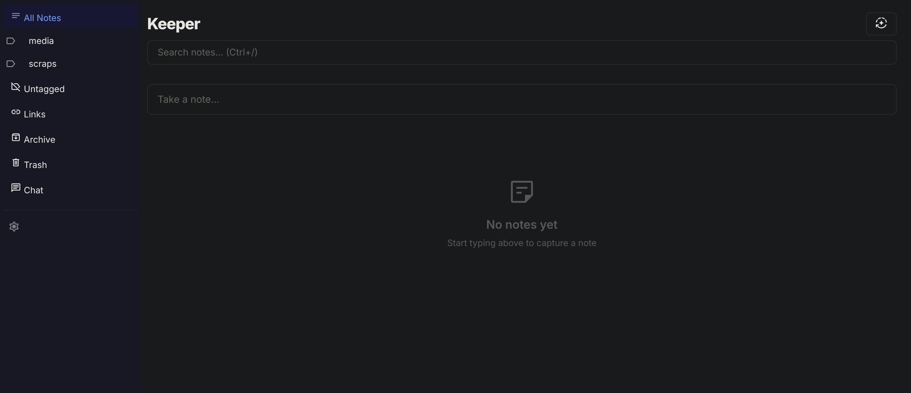
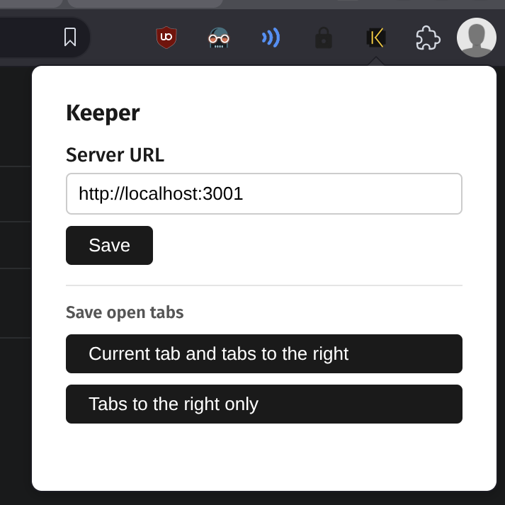

# Keeper



Shamelessly vibecoded replacement for Google Keep.

Made because Keep has too many features I don't care about and no good functionality for exporting data.

Only intended for single-user use, i.e. me.

So no promises it will be of any value to you!

## Does it actually work?

Yeah. I have been running it in earnest and it's quite smooth (better than Google Keep for my workflows).

It runs quite fast (all local so no big achievement) but I have spent a fair bit of time and tokens on polish and not-insane code.

### Limitations

I've made some attempts to get the UI responsive for mobile usage, but it's not been a focus so far.

I'm trying to get it working as a PWA for mobile usage but not had any success so far.

## Features

The basic flow is just Google Keep, but with a much stronger focus on being a digital inbox/scrapbook.

Add notes quickly, sort and archive them automatically, export them to more durable storage easily.

- You can hit a button to automatically tag notes containing URLs via a regex. So all youtube.com links get a 'media' tag and archived.
- There's a filter specifically for notes with links, and for untagged notes.
- You can bulk-export arbitrary notes in a few seconds and delete them afterwards. Very little fuss.
- There is also an AI chatbot page. You can ask it to search your notes and manage them to a basic level. It asks permission before issuing deletes.

There is also a browser extension in this repo for sending content to the app; it works without issue.



## Running as a service

To run Keeper on startup as a systemd user service:

```bash
# Install the service file
mkdir -p ~/.config/systemd/user
cp keeper.service ~/.config/systemd/user/keeper.service

# Enable and start
systemctl --user daemon-reload
systemctl --user enable keeper
systemctl --user start keeper
```

The checked-in unit assumes this repo lives at `~/src/keeper` and that `npm` is available through the service `PATH`. If either differs, edit `WorkingDirectory`, `DATA_DIR`, or `PATH` in `~/.config/systemd/user/keeper.service`.

Keeper will be available at **http://localhost:3001**. The service builds the frontend on start and runs the API server.

Useful commands:

```bash
systemctl --user status keeper    # check status
systemctl --user restart keeper   # restart after code changes
journalctl --user -u keeper -f    # view logs
```

To ensure user services run on boot (even before login):

```bash
sudo loginctl enable-linger $USER
```

## Development

```bash
npm run dev        # starts both the API server and Vite dev server
npm run dev:vite   # Vite only (frontend)
npm run server     # API server only
```
